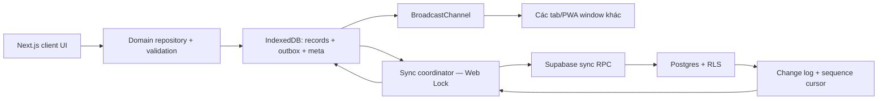

# Kế hoạch nâng cấp toàn diện — Chi tiêu

> Cập nhật: 2026-07-23  
> Trạng thái: Đề xuất, chưa triển khai  
> Phạm vi: UI/UX, local-first, đồng bộ hai thiết bị, bảo mật dữ liệu, PWA, logic nghiệp vụ, kiểm thử và tính năng sản phẩm

## 1. Tóm tắt quyết định

Ứng dụng sẽ tiếp tục theo kiến trúc **local-first**:

- IndexedDB là nguồn dữ liệu phục vụ UI trên từng thiết bị.
- Mọi thao tác thêm/sửa/xóa phải hoàn thành trên máy mà không chờ Supabase hoặc Vercel.
- Supabase tiếp tục được dùng làm bản sao từ xa, xác thực và cầu đồng bộ giữa laptop với điện thoại.
- Vercel chủ yếu phục vụ static app shell/PWA; không đặt Supabase hoặc Server Action trên critical path của thao tác hằng ngày.
- Không chuyển sang một backend trả phí và không thêm dịch vụ có chi phí bắt buộc.
- Vẫn tối ưu cho một người dùng, hai thiết bị, VND và dữ liệu tài chính cá nhân.

Trước khi thêm nhiều tính năng, cần hoàn thành một bản **Trust Release** để giải quyết các rủi ro mất dữ liệu, đổi tài khoản, import sai, conflict và thao tác xóa nhầm.

## 2. Mục tiêu thành công

### 2.1. Dữ liệu và đồng bộ

- Không có tình huống tài khoản khác nhìn thấy hoặc upload nhầm dữ liệu local hiện có.
- Hai thiết bị hội tụ về cùng trạng thái sau khi online trở lại.
- Edit cũ từ thiết bị offline không âm thầm ghi đè edit mới.
- Xóa được truyền sang thiết bị còn lại và không làm bản ghi “sống lại”.
- Một mutation lỗi không được chặn toàn bộ hàng đợi.
- Initial sync tải đủ dữ liệu khi có hơn 1.000 và tối thiểu 10.000 giao dịch.
- Có đường xử lý conflict, retry, dead-letter và recovery rõ ràng cho người dùng.

### 2.2. Trải nghiệm

- App mở và hiển thị dữ liệu local mà không phụ thuộc thời gian đánh thức Supabase/Vercel.
- Thêm giao dịch phổ biến hoàn thành trong vài giây và tối đa vài thao tác.
- Không hiển thị số `0 đ` giả trong khi IndexedDB đang tải.
- Mọi thao tác lưu, xóa, import và sync đều có feedback dễ hiểu.
- Mobile không bị bộ lọc chiếm nửa màn hình, bottom nav không che nội dung hoặc bàn phím.
- Các luồng chính dùng được bằng bàn phím và screen reader ở mức hợp lý.

### 2.3. Chất lượng kỹ thuật

- `npm run lint`, typecheck, unit test và E2E đều pass trong CI.
- Service worker không chạy trong development và không giữ app shell cũ sau deploy.
- Chỉ còn một data architecture chính; loại bỏ code server-first không còn sử dụng.
- Migration Supabase và IndexedDB có rollback/recovery plan, không xóa dữ liệu để “sửa nhanh”.

## 3. Ngoài phạm vi trước mắt

- Không xây app native Android/iOS riêng.
- Không triển khai multi-user household/shared wallet trong giai đoạn đầu.
- Không làm OCR/AI receipt trước khi core sync và recovery ổn định.
- Không thêm crypto, đầu tư, kế toán kép đầy đủ hoặc multi-currency trong Trust Release.
- Không thay toàn bộ visual identity; giao diện hiện tại được giữ và tinh chỉnh có chọn lọc.

## 4. Hiện trạng và vấn đề ưu tiên

| Mức | Vấn đề | Hệ quả | Hướng xử lý |
| --- | --- | --- | --- |
| P0 | Pull toàn bộ rồi replace local, không phân trang | Dữ liệu ngoài giới hạn API biến mất khỏi snapshot local | Bootstrap có pagination; sau đó pull incremental bằng cursor |
| P0 | Không có version/tombstone | Stale edit ghi đè, delete bị resurrect | `version`, `updated_at`, `deleted_at`, conflict detection |
| P0 | Mutation lỗi chặn cả outbox | Sync kẹt vĩnh viễn | Retry policy, dead-letter, compact/batch outbox |
| P0 | Import không validate/không atomic | Dữ liệu hỏng hoặc import một nửa | Versioned schema, dry-run, preview, một transaction |
| P0 | Xóa ngay, không Undo/Trash | Mất dữ liệu do chạm nhầm | Soft delete, Undo, confirm theo mức tác động |
| P1 | Service worker cache thủ công Next RSC | Offline không ổn định, cache phình, app cũ sau deploy | PWA strategy có version, fallback và update prompt |
| P1 | Form thiếu error handling | Có thể kẹt “Đang lưu…” | `try/catch/finally`, toast, error boundary |
| P1 | Ngày mặc định dựa trên UTC | Sai ngày trước 07:00 tại Việt Nam | Dùng helper local date duy nhất |
| P1 | Amount cho phép `0` nhưng SQL yêu cầu `> 0` | Mutation độc làm kẹt sync | Domain validator dùng chung |
| P1 | Mobile filters quá lớn | Insight và giao dịch bị đẩy xuống dưới | Compact period picker + filter sheet |
| P1 | Không có test suite/CI | Regression sync và migration khó phát hiện | Vitest + Playwright + CI |
| P2 | Tồn tại data layer server-first cũ | Hai nguồn sự thật, tăng attack surface | Xóa/cô lập legacy sau khi kiểm kê |

## 5. Kiến trúc đích

### 5.1. Nguyên tắc

1. UI chỉ đọc từ local selectors/repository.
2. Ghi record và outbox phải cùng một IndexedDB transaction.
3. Network sync không được clear toàn bộ local store trong luồng bình thường.
4. Server là nơi cấp thứ tự thay đổi và xác nhận version, không dựa vào đồng hồ thiết bị.
5. Delete là tombstone trong thời gian retention, không hard-delete ngay.
6. Sync nhiều tab chỉ có một leader.
7. Realtime, nếu dùng, chỉ gửi tín hiệu “có thay đổi”; dữ liệu vẫn pull bằng cursor có thể retry.
8. Không log nội dung tài chính hoặc note ra telemetry bên ngoài.

## 6. Thiết kế dữ liệu và sync v2

### 6.1. Supabase migrations

Tạo migration có version trong `supabase/migrations/`, không tiếp tục phụ thuộc vào việc chạy các file SQL rời thủ công.

Các cột chung cho entity có thể chỉnh sửa:

- `updated_at timestamptz not null default now()`
- `deleted_at timestamptz null`
- `version bigint not null default 1`
- `updated_by_device uuid null`

Bảng/hạ tầng mới đề xuất:

- `sync_changes`
  - `seq bigserial primary key`
  - `user_id uuid not null`
  - `table_name text not null`
  - `entity_id uuid not null`
  - `operation text check (operation in ('upsert', 'delete'))`
  - `version bigint not null`
  - `changed_at timestamptz not null default now()`
- `sync_mutations`
  - Lưu `mutation_id` đã xử lý để batch retry có tính idempotent.
  - Có retention và cleanup định kỳ phù hợp free tier.
- RPC `apply_sync_batch`
  - Nhận `device_id` và danh sách mutations.
  - Kiểm tra `base_version`.
  - Áp các mutation hợp lệ trong transaction.
  - Trả `applied`, `conflicts`, `permanent_errors`, version mới và cursor mới nhất.
- RPC/query `pull_changes_after(cursor, limit)`
  - Trả thay đổi theo `seq` tăng dần.
  - Client pull nhiều trang cho đến khi hết.

### 6.2. RLS và ownership liên bảng

- Giữ RLS `auth.uid() = user_id` cho mọi bảng.
- Bổ sung kiểm tra ownership cho quan hệ:
  - transaction → category
  - budget → category
  - recurring template → category
  - debt payment → debt
- Ưu tiên composite FK `(related_id, user_id)` hoặc trigger/policy `exists` kiểm tra cùng owner.
- Thêm index phục vụ `user_id`, `updated_at`, `deleted_at`, `occurred_on`, `category_id`, `debt_id` và `sync_changes(user_id, seq)`.
- Budget phải có constraint tháng là ngày đầu tháng.
- Debt status nên là dữ liệu suy ra từ tổng payments hoặc được cập nhật bởi transaction/RPC server, không tin một field stale từ thiết bị.

### 6.3. Conflict policy

- Mỗi update gửi `base_version` là version client đã đọc.
- Nếu server version trùng `base_version`: apply bình thường.
- Nếu khác:
  - Không âm thầm ghi đè.
  - Lưu conflict local với cả bản local và server.
  - Hiển thị lựa chọn “Giữ bản trên máy”, “Giữ bản từ thiết bị kia” hoặc “Xem chi tiết”.
- Với entity tạo mới có cùng natural key:
  - Budget dùng deterministic ID hoặc upsert theo `(user_id, category_id, month)`.
  - Recurring occurrence có `recurring_template_id` và unique `(template_id, occurred_on)`.
- Tombstone giữ tối thiểu 90 ngày trước khi cleanup để thiết bị offline dài ngày vẫn nhận delete.

### 6.4. IndexedDB v2

Nâng `DB_VERSION` bằng migration không phá dữ liệu.

Meta bắt buộc:

- `schemaVersion`
- `vaultId`
- `ownerUserId`
- `deviceId`
- `lastPulledSeq`
- `lastSuccessfulSyncAt`
- `storagePersisted`
- `migrationState`

Outbox entry bổ sung:

- `sequence` auto-increment để có thứ tự ổn định.
- `mutationId`
- `baseVersion`
- `attempts`
- `nextRetryAt`
- `lastErrorCode`
- `lastErrorMessage`
- `state: pending | retrying | conflict | dead-letter`

Indexes local cần cân nhắc:

- Transactions theo `occurred_on`, `category_id`, `type`.
- Budgets theo `month` và `category_id`.
- Payments theo `debt_id` và `paid_on`.
- Outbox theo `state`, `sequence`, `nextRetryAt`.

### 6.5. Account/vault lifecycle

- Thiết bị chưa đăng nhập có thể tạo local anonymous vault.
- Lần đăng nhập đầu:
  - Nếu remote trống: cho bind local vault với account.
  - Nếu cả local và remote đều có dữ liệu: bắt buộc preview và chọn Merge/Replace/Export trước.
- Khi account khác đăng nhập:
  - Khóa vault cũ ngay.
  - Không push outbox trước khi xác nhận owner.
  - Cho chọn chuyển vault, export hoặc xóa dữ liệu thiết bị.
- Khi logout còn pending:
  - Hiển thị số thay đổi chưa sync.
  - Cho “Đồng bộ rồi đăng xuất”, “Xuất backup”, hoặc “Đăng xuất nhưng giữ trên máy”.
- Nếu người dùng muốn bảo mật local:
  - Thêm PIN/WebAuthn gate ở tầng UI.
  - Ghi rõ đây không phải mã hóa toàn bộ IndexedDB nếu chưa triển khai encryption at rest.

## 7. Kế hoạch triển khai theo sprint

## Sprint 0 — Security và quality baseline

**Ước tính:** 0,5–1,5 ngày  
**Mục tiêu:** tạo baseline sạch trước khi migration dữ liệu.

### Công việc

- [ ] Đọc tài liệu Next.js 16 tương ứng trong `node_modules/next/dist/docs/` trước khi sửa Next/PWA.
- [ ] Nâng Next.js từ `16.2.10` lên bản patch đã vá phù hợp, tối thiểu `16.2.11`.
- [ ] Chạy lại `npm audit --omit=dev`, ghi nhận advisory còn lại và phạm vi áp dụng.
- [ ] Sửa hoặc loại khỏi lint script tạm `scratch_replace.js` mà không làm mất công cụ còn cần dùng.
- [ ] Thêm scripts:
  - `typecheck`
  - `test`
  - `test:e2e`
  - `check` chạy lint + typecheck + unit test
- [ ] Cài Vitest, Testing Library và `fake-indexeddb` hoặc bộ tương đương.
- [ ] Tạo GitHub Actions CI cho Node version cố định và `npm ci`.
- [ ] Chỉ register service worker khi production.
- [ ] Mount Toaster một lần ở root layout.
- [ ] Thêm `error.tsx`, `global-error.tsx` và `not-found.tsx` tối thiểu.

### Tiêu chí nghiệm thu

- [ ] `npm run lint` pass.
- [ ] `npm run typecheck` pass.
- [ ] `npm run test` có ít nhất một test smoke và pass.
- [ ] Development không còn service worker/cache can thiệp HMR.
- [ ] `npm audit --omit=dev` không còn issue đã có patch trực tiếp chưa áp dụng.

## Sprint 1 — Trust Release: local safety và UX recovery

**Ước tính:** 3–5 ngày  
**Mục tiêu:** dữ liệu local đáng tin ngay cả trước sync v2.

### Domain validation

- [ ] Tạo schema validator dùng chung cho Category, Transaction, Budget, Recurring, Debt và Payment.
- [ ] Amount/limit/payment phải `> 0`, hữu hạn và nằm trong giới hạn `numeric(14,2)`.
- [ ] Chuẩn hóa string trim, enum, UUID, màu và date `YYYY-MM-DD` hợp lệ.
- [ ] Validate `from <= to` cho mọi date range.
- [ ] Không cho debt total thấp hơn tổng đã trả nếu chưa xác nhận cách xử lý.
- [ ] Không cho đổi loại category nếu tạo mâu thuẫn với transaction, recurring hoặc budget mà chưa có migration choice.

### Date và money utilities

- [ ] Tạo một helper local date duy nhất; xóa các chỗ dùng `toISOString().slice(0, 10)` cho ngày người dùng.
- [ ] Hiển thị ngày theo `vi-VN` nhưng lưu ISO local date.
- [ ] Tạo amount input có format dấu nghìn, `inputMode="numeric"` và caret ổn định.
- [ ] Thêm quick amount chips cấu hình được.

### Error/loading/feedback

- [ ] Mọi form dùng `try/catch/finally` và có toast lỗi.
- [ ] Hiển thị “Đã lưu trên máy” ngay sau commit local.
- [ ] Không render dashboard 0đ khi local snapshot chưa sẵn sàng.
- [ ] Dùng skeleton giữ layout, tránh false zero và layout shift.
- [ ] Hiển thị storage error/quota error với nút retry và hướng dẫn export cứu dữ liệu.
- [ ] Reset cached IndexedDB open promise khi open lỗi để retry thực sự hoạt động.

### Delete/recovery

- [ ] Transaction: soft delete + Undo 10 giây.
- [ ] Category, debt và restore/replace: confirm dialog mô tả dữ liệu liên quan bị ảnh hưởng.
- [ ] Tạo màn hình Trash hoặc mục recovery tối thiểu.
- [ ] Không hard-delete child local ngoài outbox contract.

### Import/export v2

- [ ] Backup có `formatVersion`, `exportedAt`, `appVersion`, checksums/counts.
- [ ] Validate toàn bộ file trước mutation đầu tiên.
- [ ] Strip `user_id`, version server và field không cho phép từ file.
- [ ] Preview record counts, warning, Merge/Replace.
- [ ] Tự xuất safety backup trước Replace.
- [ ] Bulk import trong một IndexedDB transaction và chỉ phát một change event.
- [ ] CSV export chống formula injection cho cell bắt đầu bằng `=`, `+`, `-`, `@`.
- [ ] Có tùy chọn backup JSON mã hóa bằng WebCrypto nếu người dùng đặt mật khẩu.

### Tiêu chí nghiệm thu

- [ ] Không tạo được record 0đ bằng UI, repository hoặc import.
- [ ] Test ngày đúng tại 00:01 và 06:59 giờ Việt Nam.
- [ ] Import file lỗi không ghi được bất kỳ record nào.
- [ ] Xóa nhầm giao dịch có thể Undo.
- [ ] Lỗi IndexedDB không để form kẹt ở trạng thái saving.

## Sprint 2 — Sync engine v2

**Ước tính:** 5–8 ngày  
**Mục tiêu:** đồng bộ đúng và có thể phục hồi giữa hai thiết bị/nhiều tab.

### Database

- [ ] Tạo migration thêm version/tombstone/change log.
- [ ] Tạo RLS ownership liên bảng và indexes.
- [ ] Tạo RPC apply batch có idempotency.
- [ ] Tạo pull-by-cursor có pagination.
- [ ] Tạo cleanup policy cho tombstone/mutation receipts, không xóa quá sớm.

### Client sync coordinator

- [ ] Bind vault với owner trước khi đọc session để push.
- [ ] Generate và persist `deviceId`.
- [ ] Dùng Web Locks hoặc IndexedDB lease để chỉ một sync leader.
- [ ] Dùng BroadcastChannel để refresh tab khác và phát trạng thái sync.
- [ ] Compact outbox theo `(table, entityId)` mà vẫn bảo toàn dependency parent/child.
- [ ] Batch mutation và phân loại lỗi:
  - retryable network/server error
  - conflict
  - permanent validation/constraint error
- [ ] Exponential backoff có jitter và giới hạn.
- [ ] Dead-letter UI cho phép xem, sửa, bỏ hoặc retry mutation.
- [ ] Initial bootstrap phân trang đầy đủ trước khi commit snapshot.
- [ ] Incremental pull bằng `lastPulledSeq`, không clear store.
- [ ] Merge remote changes và outbox trong một IndexedDB transaction/revision guard.
- [ ] Sync khi local mutation debounce, online, foreground, manual và Realtime ping.
- [ ] Bỏ full snapshot mỗi 60 giây; interval chỉ là fallback thưa hơn khi app visible.

### Conflict UI

- [ ] Hiển thị tên entity, thời gian và thiết bị nếu có.
- [ ] Cho chọn local/server và tạo mutation mới dựa trên version hiện tại.
- [ ] Có bulk action cho conflict không quan trọng.
- [ ] Không hiển thị raw JSON cho người dùng thông thường; giữ trong debug export.

### Recurring và debts

- [ ] Generate recurring local trước network sync.
- [ ] Chạy lại khi app foreground hoặc ngày đổi.
- [ ] Thêm `recurring_template_id` và uniqueness chống duplicate.
- [ ] Bỏ giới hạn catch-up cứng 24 tháng hoặc batch cho đến khi hoàn thành có cảnh báo.
- [ ] Recompute debt status từ payments trong cùng transaction/server RPC.

### Tiêu chí nghiệm thu

- [ ] Hai thiết bị edit cùng record tạo conflict, không silent overwrite.
- [ ] Delete trên thiết bị A không resurrect sau khi B online lại.
- [ ] Mutation xảy ra trong lúc pull không tạm biến mất khỏi UI.
- [ ] Hai tab không reorder update/delete.
- [ ] Một mutation hỏng không chặn mutation hợp lệ phía sau.
- [ ] Tạo budget đồng thời không làm kẹt outbox.
- [ ] Initial sync 10.000 transactions không thiếu hàng.
- [ ] Account mismatch không push bất kỳ mutation nào.

## Sprint 3 — PWA và offline production

**Ước tính:** 2–4 ngày  
**Mục tiêu:** app cài đặt được, offline dự đoán được và tự cập nhật an toàn.

### Công việc

- [ ] Thực hiện compatibility spike với Next.js 16/Turbopack trước khi chọn Serwist/Workbox hay custom generated service worker.
- [ ] Không cache raw Next RSC request thủ công nếu không có chiến lược invalidation tương thích build.
- [ ] Cache version gắn với app/build version.
- [ ] Có offline fallback page/shell riêng, không trả Dashboard HTML cho URL bất kỳ.
- [ ] Giới hạn runtime cache theo số lượng và tuổi.
- [ ] Cache static assets theo content hash.
- [ ] Thêm “Có phiên bản mới — Tải lại” thay vì `skipWaiting()` âm thầm giữa phiên.
- [ ] Thêm offline/pending indicator nhỏ ở header.
- [ ] Ghi nhận kết quả `navigator.storage.persist()` và cảnh báo nếu browser không cấp persistent storage.
- [ ] Thêm backup reminder nếu local data chưa sync hoặc storage không persistent.
- [ ] Kiểm tra maskable icon và safe zone thật trên Android.

### Tiêu chí nghiệm thu

- [ ] Cold offline launch của route đã hỗ trợ không treo hoặc reload loop.
- [ ] Route chưa cache hiển thị offline fallback đúng, không giả thành route khác.
- [ ] Deploy version mới không giữ JS/RSC cũ.
- [ ] App vẫn thao tác CRUD local khi Supabase và mạng bị chặn.
- [ ] Test bằng production build, không dựa riêng vào `next dev`.

## Sprint 4 — Mobile UX, accessibility và fast capture

**Ước tính:** 3–5 ngày  
**Mục tiêu:** giảm ma sát trong tác vụ dùng hằng ngày.

### Dashboard và filters

- [ ] Thay filter card bằng compact period switcher: Tháng này, Tháng trước, Tùy chọn.
- [ ] Custom filter mở bottom sheet/dialog.
- [ ] Transaction filters mặc định thu gọn; hiển thị active filter chips.
- [ ] Search local debounce và không bắt submit/reload route.
- [ ] Empty trend chart đổi thành empty state.
- [ ] So sánh với kỳ trước có cùng độ dài; không so custom range với một tháng đầy đủ.
- [ ] Sort budget warning theo mức nghiêm trọng.
- [ ] Card/chart có drill-down vào transaction list tương ứng.

### Quick capture

- [ ] Recent categories/favorites rõ ràng.
- [ ] “Lưu và thêm tiếp”.
- [ ] “Thêm tương tự”/duplicate từ transaction list.
- [ ] Inline CTA tạo category khi chưa có category phù hợp.
- [ ] Có bộ category mặc định tiếng Việt cho first-run.
- [ ] Giữ draft form nếu người dùng chuyển app hoặc mất focus.

### Mobile shell

- [ ] Touch targets tối thiểu khoảng 44×44px cho thao tác chính.
- [ ] Bottom nav dùng `env(safe-area-inset-bottom)`.
- [ ] Không để bottom nav che field/nút khi bàn phím mở.
- [ ] Xem lại CTA dài ở màn hình 320–375px.
- [ ] Giữ layout không horizontal overflow ở 320px.

### Accessibility

- [ ] `aria-current="page"` cho navigation active.
- [ ] Drawer dùng dialog primitive, focus trap, Escape, restore focus và body scroll lock.
- [ ] Toggle Thu/Chi dùng radiogroup hoặc `aria-pressed` đúng.
- [ ] Sync/loading/error dùng live region phù hợp.
- [ ] Chart có text/table summary fallback.
- [ ] Không chỉ dùng màu đỏ/xanh để truyền đạt trạng thái.
- [ ] Tôn trọng `prefers-reduced-motion`.
- [ ] Axe không còn violation critical/serious trên các route chính.

## Sprint 5 — Product foundation: accounts và ngân sách

**Ước tính:** 5–10 ngày  
**Mục tiêu:** biến “số dư” thành số liệu có ý nghĩa và nâng app khỏi CRUD cơ bản.

### Accounts/wallets

- [ ] Thêm bảng `accounts`:
  - tên
  - loại: cash/bank/e-wallet/other
  - opening balance
  - archived state
  - thứ tự/màu/icon tùy chọn
- [ ] Thêm `account_id` cho transaction.
- [ ] Migration dữ liệu cũ vào account “Chưa phân loại” hoặc account mặc định do người dùng chọn.
- [ ] Thêm `transfers` với from/to account, amount, date, note.
- [ ] Transfer không được tính thành income/expense nhưng phải ảnh hưởng balance từng account.
- [ ] Dashboard đổi “Số dư tổng” thành tổng balance accounts.
- [ ] Nếu chưa triển khai accounts, đổi nhãn hiện tại thành “Chênh lệch tích lũy” để tránh hiểu nhầm.

### Budgets

- [ ] Month picker và lịch sử.
- [ ] Copy/carry-forward ngân sách tháng trước.
- [ ] Tổng budget, đã dùng, còn lại và safe daily spend.
- [ ] Không tạo duplicate cho cùng category/tháng.
- [ ] Có drill-down các giao dịch làm vượt ngân sách.

### Recurring

- [ ] Frequency monthly/weekly/yearly.
- [ ] Next occurrence, end date và skip một kỳ.
- [ ] Timeline khoản sắp tới.
- [ ] Local notification/reminder nếu browser hỗ trợ; không phụ thuộc dịch vụ trả phí.

## Sprint 6 — Import ngân hàng, insights và cleanup

**Ước tính:** 4–8 ngày, có thể chia nhỏ  
**Mục tiêu:** tăng giá trị sử dụng mà không làm phình kiến trúc core.

### Tính năng

- [ ] CSV import có mapping cột, preview và preset theo ngân hàng.
- [ ] Duplicate detection bằng fingerprint có giải thích được.
- [ ] Tags/merchant/payment method nếu thực sự cần tìm kiếm sâu hơn category.
- [ ] Actionable dashboard:
  - giao dịch gần đây
  - recurring sắp tới
  - nợ quá hạn
  - ngân sách sắp vượt
  - savings rate
- [ ] Chỉ cân nhắc receipt image/OCR sau khi đánh giá quota storage, privacy và backup.

### Cleanup

- [ ] Kiểm kê và xóa/cô lập `src/lib/actions`, `src/lib/data`, server recurring generator và `/api/export` cũ nếu không còn consumer.
- [ ] Chuyển chart types khỏi legacy data module.
- [ ] Generate Supabase Database types; loại bỏ `as never` ở sync.
- [ ] Tách các file JSX một dòng thành component/selectors có thể test.
- [ ] Chuẩn hóa naming, error codes và Vietnamese copy.
- [ ] Cập nhật README và tài liệu migration/deploy.

## 8. Test strategy

### 8.1. Unit tests

- [ ] Local date tại timezone Việt Nam, cuối tháng, năm nhuận và DST-agnostic behavior.
- [ ] Money parsing/formatting và giới hạn số.
- [ ] Domain schemas cho dữ liệu hợp lệ/sai.
- [ ] Budget natural key và percent calculations.
- [ ] Debt status khi thêm/xóa/sửa payment hoặc total.
- [ ] Recurring ngày 29/30/31, leap year, backlog dài và deterministic occurrence.
- [ ] Outbox compaction, dependency order, retry/backoff và dead-letter.
- [ ] Conflict resolver và tombstone merge.
- [ ] Import validation, atomicity, Merge/Replace và CSV formula sanitization.

### 8.2. IndexedDB integration tests

- [ ] Upgrade từ DB v1 sang v2 không mất record.
- [ ] Record + outbox atomic trong transaction.
- [ ] Mutation trong lúc pull không bị replace mất.
- [ ] Database open bị reject có thể retry.
- [ ] Bulk import chỉ phát một refresh event.
- [ ] Account/vault mismatch khóa data và sync.

### 8.3. Supabase/RLS tests

- [ ] User A không đọc/sửa/xóa dữ liệu B.
- [ ] User A không tham chiếu category/debt của B.
- [ ] Duplicate mutation ID không áp hai lần.
- [ ] Base version sai trả conflict.
- [ ] Change cursor không thiếu hoặc lặp thay đổi ngoài contract.
- [ ] Pagination tải đủ hơn 1.000/10.000 transactions.

### 8.4. Playwright E2E

- [ ] Desktop và mobile add/edit/delete/undo transaction.
- [ ] Offline CRUD, reload và online resync.
- [ ] Hai browser context mô phỏng hai thiết bị.
- [ ] Update/update, update/delete, delete/update conflict.
- [ ] Hai tab cùng sync.
- [ ] Logout có pending và account switch.
- [ ] Import file hỏng/partial/foreign owner.
- [ ] Budget duplicate, category cascade và debt overpayment.
- [ ] PWA cold offline launch và update version bằng production build.
- [ ] Keyboard-only và axe smoke test các route chính.

### 8.5. Manual device matrix

- [ ] Chrome Android cài PWA từ Vercel.
- [ ] Edge/Chrome Windows cài PWA.
- [ ] Laptop và Android online đồng thời.
- [ ] Một thiết bị offline ít nhất 24 giờ rồi sync lại.
- [ ] App bị đóng giữa import/sync rồi mở lại.
- [ ] Browser storage bị gần quota hoặc persistent storage không được cấp.

## 9. Performance budget

- Local CRUD phản hồi trực quan mục tiêu dưới 100 ms; commit IndexedDB không làm UI block lâu.
- Không có request Supabase/Vercel bắt buộc trước khi mở dashboard có dữ liệu local.
- Không full-scan toàn bộ sáu stores cho mọi mutation khi dataset lớn; dùng selector/index hoặc snapshot batching.
- Initial sync lớn có progress và không giữ main thread.
- Transaction list có pagination/virtualization khi số dòng đủ lớn để ảnh hưởng render.
- Charts được dynamic import hoặc trì hoãn nếu làm chậm first interaction.
- Sync batch có giới hạn kích thước và số request, tránh một request cho mỗi record import.

## 10. Observability và hỗ trợ sự cố

Trang “Thiết bị & đồng bộ” cần hiển thị:

- Account/email đang bind.
- Device ID/name thân thiện.
- Local schema version và remote sync version.
- Last successful sync.
- Pending/retrying/conflict/dead-letter counts.
- Last error code với hướng xử lý.
- Trạng thái online/offline và persistent storage.
- Nút sync, retry, export debug bundle và export backup.

Debug bundle không được chứa note, amount hoặc dữ liệu tài chính nguyên văn theo mặc định; chỉ chứa metadata, counts, version và error codes.

## 11. Migration và rollout an toàn

### Trước migration

- [ ] Yêu cầu xuất JSON backup v1 trên cả hai thiết bị.
- [ ] Đảm bảo outbox cũ đã sync hoặc được ghi rõ trong backup.
- [ ] Chụp count từng bảng local/remote để đối chiếu.
- [ ] Test migration trên bản copy dữ liệu trước production.

### Thứ tự deploy

1. Deploy Supabase migration backward-compatible: chỉ thêm cột/bảng/RPC, chưa drop gì.
2. Deploy app hiểu cả schema cũ và mới trong giai đoạn chuyển tiếp nếu cần.
3. Mở app trên một thiết bị, chạy local DB migration và bootstrap kiểm tra.
4. Xác nhận counts, sync và export.
5. Sau đó mới mở/cập nhật thiết bị thứ hai.
6. Chờ ít nhất một release ổn định trước khi xóa code/cột legacy.

### Rollback

- Không drop cột cũ trong cùng release thêm schema mới.
- App rollback phải bỏ qua các cột mới mà không làm hỏng dữ liệu.
- Service worker cache version phải đổi khi rollback/deploy.
- Nếu local migration lỗi: khóa write, cho retry hoặc export recovery; không tự clear IndexedDB.
- Có script/checklist phục hồi từ JSON v1/v2 và kiểm tra counts sau restore.

## 12. Rủi ro và biện pháp giảm thiểu

| Rủi ro | Biện pháp |
| --- | --- |
| Migration IndexedDB bị blocked bởi tab/PWA cũ | Broadcast yêu cầu đóng tab, timeout có hướng dẫn, không clear DB |
| Clock thiết bị sai | Dùng server sequence/version, không dùng client timestamp quyết định conflict |
| Supabase free chậm/tạm unavailable | Local commit độc lập, retry backoff, trạng thái rõ ràng |
| Storage browser bị evict | Xin persistent storage, cảnh báo, backup và remote sync |
| Service worker giữ bundle cũ | Build-versioned cache, update prompt, không cache RSC tùy tiện |
| Mutation cha/con sai thứ tự | Dependency-aware batch hoặc server transaction |
| Tombstone tăng dung lượng | Retention 90 ngày và cleanup sau khi thiết bị/cursor an toàn |
| Import quá lớn làm treo UI | Validate/batch bằng worker hoặc chunk có progress, một atomic commit hợp lý |
| Feature accounts làm sai số dư cũ | Account “Chưa phân loại”, reconciliation và migration preview |

## 13. Definition of Done cho mỗi sprint

- [ ] Acceptance criteria của sprint pass.
- [ ] Unit/integration/E2E liên quan được thêm và pass.
- [ ] `npm run check` pass.
- [ ] Production build pass.
- [ ] Không còn console error mới ngoài lỗi môi trường đã giải thích.
- [ ] Không để file test artifact hoặc secret trong git.
- [ ] Migration và rollback note được cập nhật.
- [ ] README/copy UI phản ánh hành vi thật, đặc biệt về local, sync và backup.
- [ ] Test thủ công mobile + desktop cho flow bị ảnh hưởng.
- [ ] Worktree được review để không xóa/chạm thay đổi ngoài scope.

## 14. Thứ tự ưu tiên nếu cần rút gọn

Nếu chỉ có thời gian làm một phần, thực hiện đúng thứ tự sau:

1. Nâng Next và làm quality baseline.
2. Owner-bound local vault/account mismatch guard.
3. Validation, local date, import atomic và delete recovery.
4. Bootstrap pagination để không mất snapshot khi vượt giới hạn.
5. Sync v2: version, tombstone, cursor, dead-letter, multi-tab lock.
6. PWA offline/update ổn định.
7. Mobile filters, feedback, onboarding và accessibility.
8. Accounts/wallets + transfers.
9. Budget/recurring nâng cao.
10. CSV ngân hàng, insights và các tiện ích mở rộng.

## 15. Kết quả cuối kỳ vọng

Sau khi hoàn thành các sprint cốt lõi, app phải có cảm giác như một ứng dụng cài trên máy:

- Mở nhanh và dùng ngay cả khi mạng hoặc Supabase chậm.
- Người dùng luôn biết dữ liệu đã lưu local, đang chờ hay đã sync.
- Hai thiết bị không âm thầm ghi đè hoặc làm mất dữ liệu của nhau.
- Có thể khôi phục sau xóa nhầm, import lỗi hoặc migration lỗi.
- UI mobile tập trung vào nhập giao dịch nhanh thay vì form/filter dài.
- “Số dư”, ngân sách, định kỳ và nợ có logic nhất quán, kiểm thử được.
- Tiếp tục chạy được trên Supabase Free + Vercel Free mà không gây khó chịu trong luồng sử dụng hằng ngày.
